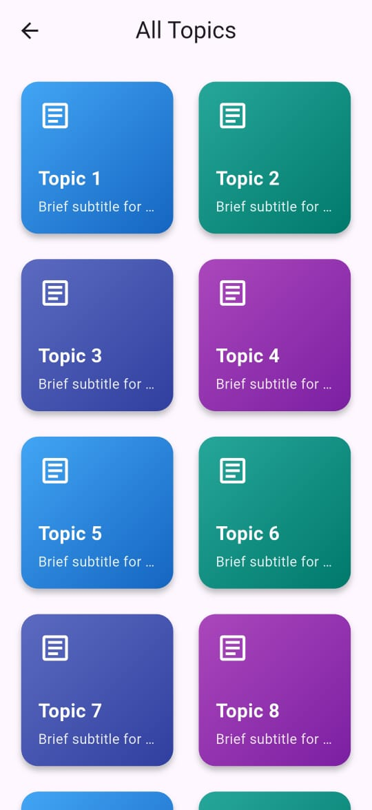
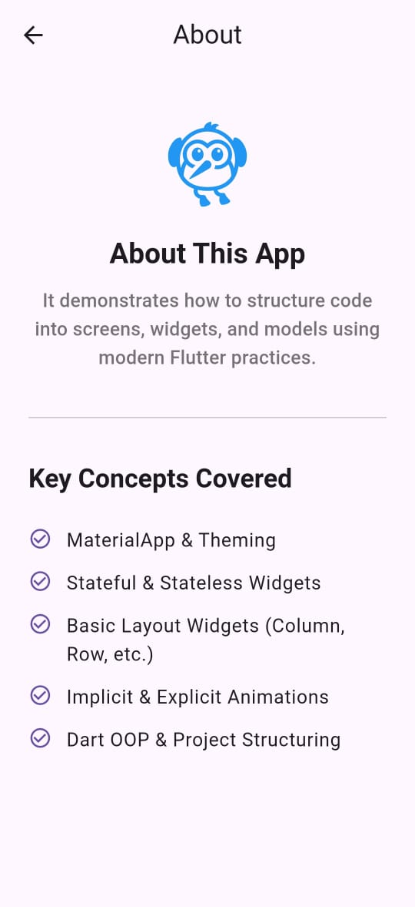

# Flutter Study App

A beautifully designed, simple Flutter application built to demonstrate core concepts and modern UI/UX practices. This project serves as an excellent starting point for beginners looking to understand project structure, navigation, and creating elegant user interfaces in Flutter.

## Demo

<p align="center">
  
</p>

---

## 🌟 Features

-   **Dynamic Home Screen**: Features an animated, horizontally scrolling welcome text and a clean, responsive layout.
-   **Interactive Topic Grid**: Displays a list of study topics in a visually appealing grid with gradient backgrounds and icons.
-   **Modern Modal Details**: Tapping a topic reveals its details in a sleek, rounded modal bottom sheet.
-   **Polished About Page**: A well-structured "About" screen with great typography and layout.
-   **Named Routes**: Uses a clean navigation system with named routes for better code organization.
-   **Responsive UI**: The layout is designed to adapt gracefully to different screen sizes.

---

## 📸 Screenshots

| Home Screen                                                                                             | Topics Screen                                                                                           | About Screen                                                                                            |
| ------------------------------------------------------------------------------------------------------- | ------------------------------------------------------------------------------------------------------- | ------------------------------------------------------------------------------------------------------- |
|  |  |  |

---

## 🛠️ Technologies & Concepts Covered

This project is a practical demonstration of the following Flutter and Dart concepts:

-   **Project Structure**: Organization of code into `screens`, `models`, and `main.dart`.
-   **Core Widgets**: `Scaffold`, `AppBar`, `Column`, `Padding`, `SizedBox`, `ElevatedButton`.
-   **Layout Widgets**: `GridView`, `Card`, `ListView`, `SafeArea`, `ClipRRect` for rounded corners.
-   **Navigation**: `MaterialApp` router, `Navigator.pushNamed`, and static `routeName` for clean navigation.
-   **UI/UX Design**:
    -   `LinearGradient` for beautiful card backgrounds.
    -   `showModalBottomSheet` for modern pop-up details.
    -   Consistent theming using `Theme.of(context).textTheme`.
    -   Using icons to enhance user experience.
-   **External Packages**:
    -   [`marquee`](https://pub.dev/packages/marquee) for creating animated scrolling text.
-   **Assets Management**: Adding and displaying images from the `assets` folder.

---

## 🚀 Getting Started

To get a local copy up and running, follow these simple steps.

### Prerequisites

Make sure you have the Flutter SDK installed on your machine. For help, check the official [Flutter installation guide](https://flutter.dev/docs/get-started/install).

### Installation

1.  **Clone the repository:**
    ```sh
    git clone [https://github.com/99Ahmadprojects/Flutter-Study-App.git]
    ```
2.  **Navigate to the project directory:**
    ```sh
    cd study-flutter-app
    ```
3.  **Install dependencies:**
    ```sh
    flutter pub get
    ```
4.  **Run the app:**
    ```sh
    flutter run
    ```

---

## 📂 Project Structure

The project follows a clean and scalable structure:
```

lib/
├── assets/
│   └── 1.jpg     # Image assets
│
├── models/
│   └── item.dart            # Data model for a topic item
│
├── screens/
│   ├── home_page.dart       # The main home screen
│   ├── list_screen.dart     # The screen showing all topics
│   └── about.dart           # The about screen
│
└── main.dart                # App entry point, routes, and theme

```
